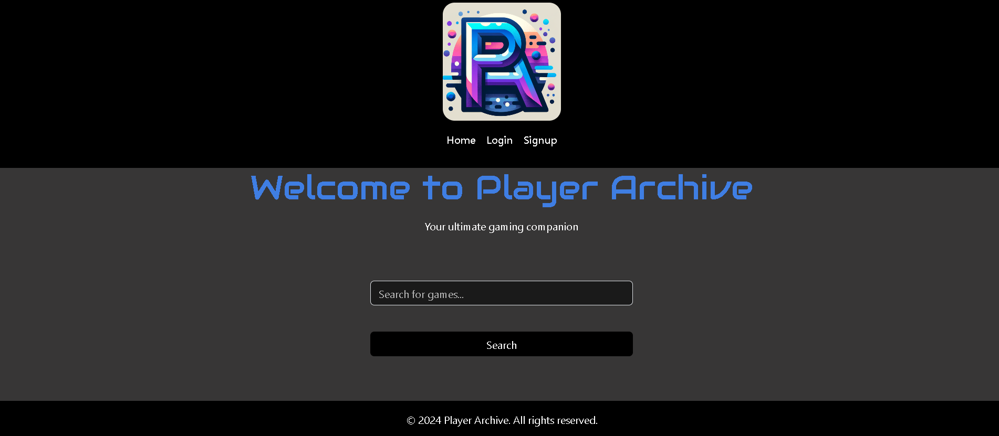
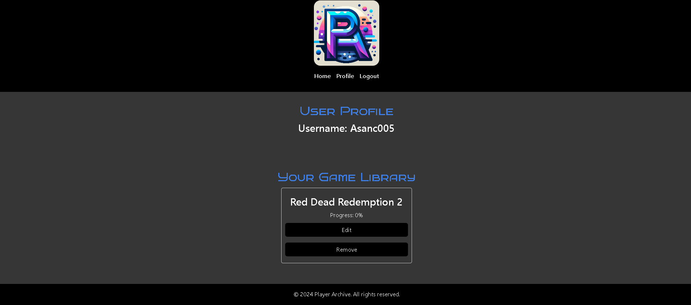

# Player-Archive
Group Project
## My Task
As a group our task was to create a scalable, user-focused MERN app that demostrates our skills with React, GraphQL, mutations, and MongoDB. The goal was to make a responsive user-friendly site that saves user-data for their next return while also including a RAWG game database that supports the data the searches for. 
## User Story
```
I want to be able to find Video Games with a game cover. I want to be able to add my game progress to my profile. I want to be able to save the game to my library and see my list of saved games.
```

## Acceptance Criteria
```
Given that I am using a video game search platform
When I open the application
Then I am able to see the seach box
Where I can enter title, keyword, genre, or ID
When I select the search button 
Then I am presented with a list of games based on my serch criteria
When I select Signup I will be able to provide my email, username, and password and make my account
Then the header will change and will give access to profile
After saving a game it will appear in library on my profile
Then I can select edit in my game library where I can change my progress percentage or remove game
After I can select Home to search for more or logout
```
## Images / Screenshot: 
Site logo: 


Opening Aplication immage: 


After Search Image: 


Game library: 




## Acknowledgements:

The team members on this project are

Alejandro Sanchez - Backend

Danniel Merino - Backend/Frontend

Diala Obeid - Frontend

## Links to Deployed Applicatiion and Github:

GitHub: https://github.com/dialaobeid/Player-Archive

Deployed Applicated:

## Resources:

Video Game Database: https://rawg.io/apidocs


