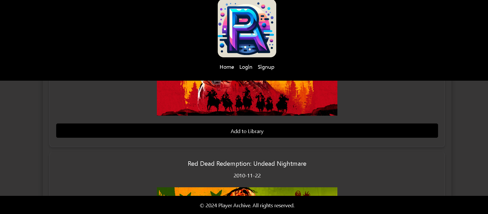

# Player-Archive
Group Project

## Group Task
Our task was to create a scalable, user-focused MERN app that demonstrates our skills with React, GraphQL, Node.js, and MongoDB. The goal was to make a responsive user-friendly site that saves user-data for their next return while also including a RAWG game database that allows users to search for games.

## User Story
```
AS A gaming enthusiast
I WANT TO build a game library
SO THAT I can illustrate my progress in each game
```
## Acceptance Criteria
```
Given that I am using a video game search platform
When I open the application
Then I am able to see a search bar
Where I can enter a game title or keyword
Then I am presented with a list of games based on my search criteria
When I select Sign up I will be able to provide my email, username, and password to create an account
Then the header will give access to my profile
When I add a game from the game search
Then it will appear in library on my profile
When I edit my game progress in library
Then the progress bar will update
When I click the Remove button
Then the game will be deleted from the library
After I can select Home to search for more games or logout
```
## Images / Screenshot:
Site logo:


Opening Application image:


After Search Image:



Game library:


## Acknowledgements:

The team members on this project are:

Alejandro Sanchez - Backend
Danniel Merino - Backend/Frontend
Diala Obeid - Frontend

## Links to Deployed Application and Github:

- GitHub: https://github.com/dialaobeid/Player-Archive
- Deployed Application: https://player-archive.onrender.com/

## Resources:

- RAWG Database: https://rawg.io/apidocs
- Chakra UI for styling
- Xpert Learning Assistant
- ChatGPT3.5
- Bootstrap styling
- Bootcamp activities (old projects)